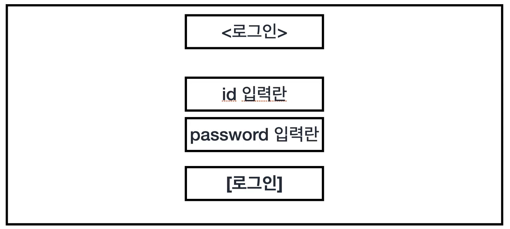
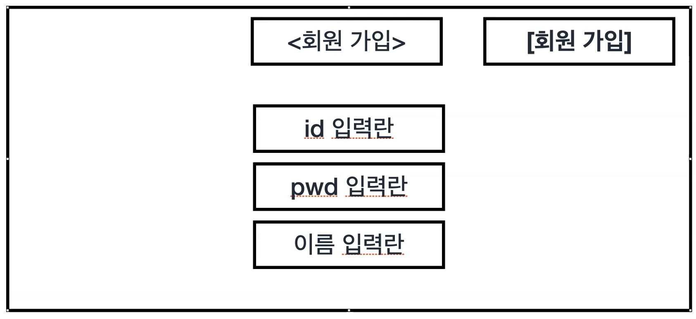
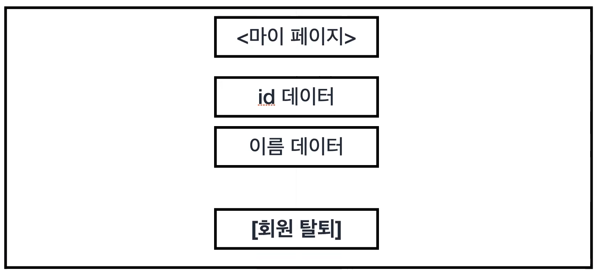
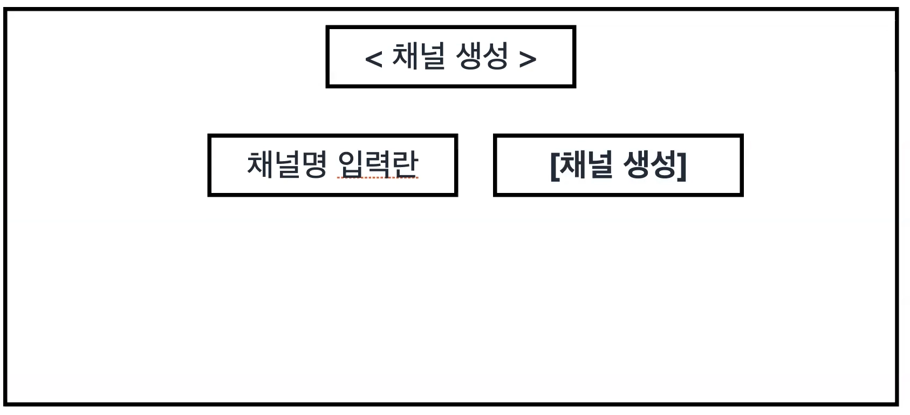
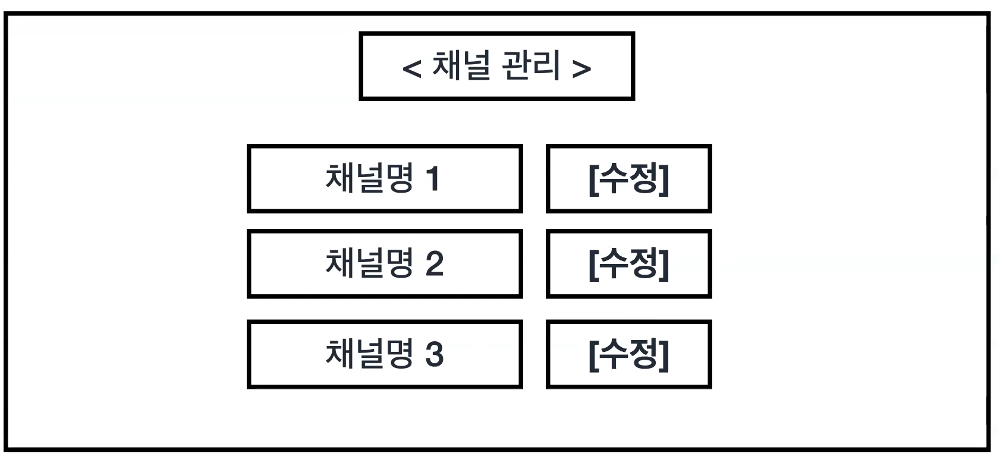
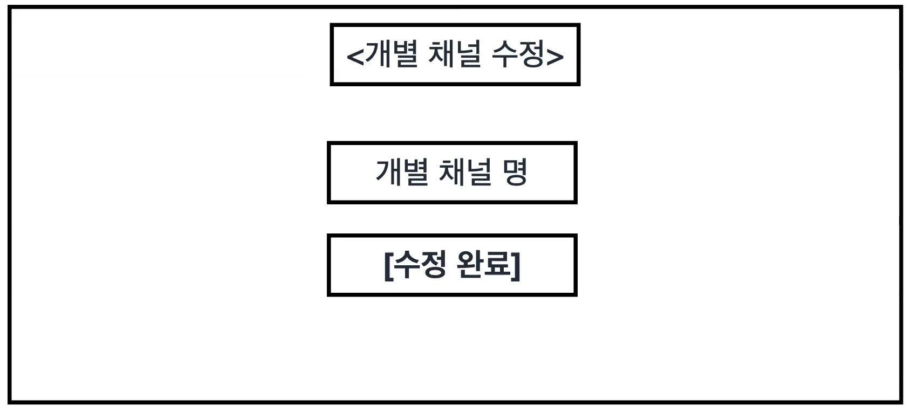

# 진짜 유튜브를 운영하는 것처럼 해봅시당 👾

## 기능목록

### 회원

- 로그인 👀: POST /login
  req: body(id, pwd)
  res: OO님 환영합니다. => main page로 갑시다.

- 회원가입 👀 POST /signup
  req: body(id,pwd)
  res: OO님 환영합니다. => Login page로 갑시다.

- 회원 개별 조회 👀 GET /user
  req: Id를 전달 (UserId)
  res: id,name

- 회원탈퇴 👀
  req: Id를 전달 (UserId)
  res: OO님, 다음에 뙤 봬요. => signup page로 갑시다.

(회원은 계정 1개당 채널 100개를 가질 수 있다.)

### 채널

- 채널 생성 👀
- 채널 수정 👀
- 채널 삭제 👀

### 컴포넌트 구성

<li>로그인 컴포넌트
</li>
<li>회원가입 컴포넌트
</li>
<li>마이페이지 컴포넌트
</li>
<li>채널생성 컴포넌트
</li>
<li>채널관리 컴포넌트
</li>
<li>채널수정 컴포넌트
</li>

### API 설계

#### 회원가입

Method: POST
 
URL:"/users/join"  
req: body- id, pwd  
res: message: 회원가입에 성공하셨습니다. or 중복이 있는 Id 입니다.

#### 로그인

Method: POST
URL:"/users/login"  
req:body- id, pwd  
res: message: 로그인에 성공하셨습니다.or 없는 아이디 입니다.

#### 마이페이지

Method: GET  
URL:"/channels/:id"  
req: url- id  
res: channels 배열

#### 채널관리

1. 수정  
   Method: POST  
   URL:"/channels"  
   req: body- 새로운 채널명, channel id  
   res: message: 채널명이 변경되었습니다.

2. 삭제
   Method: DELETE  
   URL:"/channels"  
   req: body- channel id  
   res: message: 채널이 삭제되었습니다.
